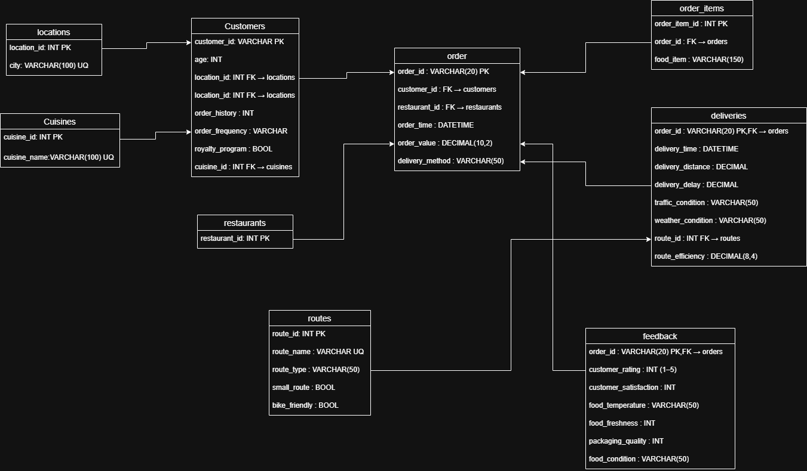

# Food Delivery Analytics Database Project

## Overview
This project implements a relational database and analytics pipeline for a food delivery platform using a normalized SQL schema, ETL pipeline, and analytical queries to study operational efficiency, customer satisfaction, routing performance, and loyalty program ROI.

The system transforms a flat food delivery dataset (20,000 orders) into a structured relational database and supports SQL-driven analysis and future AI-agent integration for natural language querying.

---

## Project Objectives

This project addresses four key business problems:

### 1. Delivery Delay Drivers
Analyze factors affecting delivery delays:

- Traffic conditions
- Weather conditions
- Delivery method
- Route choice
- Route efficiency

Goal:
Identify the highest-impact contributors to delays.

---

### 2. Route Efficiency Validation
Evaluate whether route efficiency scores predict actual delivery performance.

Compare:

- High-efficiency vs low-efficiency routes
- Delay by route type
- Route-level performance patterns

Goal:
Validate whether routing metrics are actionable.

---

### 3. Customer Satisfaction Drivers
Determine which factors most affect satisfaction:

- Food temperature
- Food freshness
- Packaging quality

Goal:
Prioritize quality improvements with highest impact.

---

### 4. Loyalty Program ROI
Measure whether loyalty customers provide higher value.

Compare:

- Revenue contribution
- Order frequency
- Average order value
- Customer ratings

Goal:
Evaluate whether the program justifies investment.

---

# Tech Stack

- Database: MySQL
- Language: Python
- Libraries:
  - pandas
  - mysql-connector-python
  - python-dotenv

---

# Dataset

Food Delivery Dataset:

- 20,000 orders
- 10 cities
- 100 restaurants
- 5 cuisines
- 5 routes

---

# Database Schema

Normalized in 3NF.

## Core Tables

### Dimension Tables
- locations
- cuisines
- routes
- restaurants
- customers

### Fact Tables
- orders
- deliveries
- feedback
- order_items

---

## Entity Relationships

Customers:

- belong to one location
- prefer one cuisine
- place many orders

Orders:

- belong to one customer
- belong to one restaurant
- have delivery data
- have customer feedback
- contain order items

Deliveries:

- use one route
- store delay, distance, weather, traffic metrics

---

## ER Diagram



---

# Project Structure

```bash
food_delivery_project/
│
├── data/
│   └── food_delivery_dataset.csv
│
├── sql/
│   ├── 01_schema.sql
│   └── 02_views_procedures.sql
│
├── etl/
│   └── etl_load.py
│
├── notebooks/
│   └── main.ipynb
│
├── .env
└── README.md